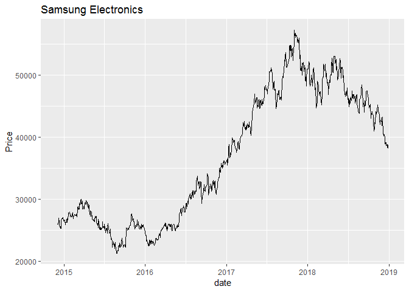

Adjusted stock price
================

In this page, we scrape adjusted stock price of Samsung Electronics from Naver finance and make graph for price.

Special Thanks to following reference. <http://henryquant.blogspot.com/search?updated-max=2018-12-03T19:55:0%2B09:00&max-results=1&pgno=1>

Initial settings
----------------

``` r
rm(list=ls())
options(warn = -1) # suppressing warning message

# Load multiple required packages at once
packages = c('rvest', 'dplyr', 'ggplot2', 'httr', 'lubridate', 'xts')
suppressMessages(lapply(packages, require, character.only = T, quietly = TRUE)) 
```

    ## [[1]]
    ## [1] TRUE
    ## 
    ## [[2]]
    ## [1] TRUE
    ## 
    ## [[3]]
    ## [1] TRUE
    ## 
    ## [[4]]
    ## [1] TRUE
    ## 
    ## [[5]]
    ## [1] TRUE
    ## 
    ## [[6]]
    ## [1] TRUE

``` r
## Character.only = T means elements in 'packages' can be assumed to be character stirngs.
## 'lubridate' package for cleansing date. 'xts' package for transforming dataset to time series data.
```

Here, We use candle chart data from NAVER finance. From Network tab on Developer's tool, we can check what kind of data are downloaded. Most of them are image files inserted in page.

We focus on 'sise.nhn?symbol=005930&timeframe=day&count=500&requestType=0' part. This part is related to candle chart.

When we connect Request URL page <https://fchart.stock.naver.com/sise.nhn?symbol=005930&timeframe=day&count=500&requestType=0> , We can see 'data="20161107|32940|33000|32680|32800|153238"/&gt;' Here, each 32940, 33000, 32680, 32800 and 153238 means initial price, high price, low price, end price and trading volume.

We use date and end price data. They are included in 'item' tag and 'date' attribute.

Scrapping adjusted stock price for Samsung Electronics
------------------------------------------------------

First, we read html and scrape all data from url.

``` r
ticker = "005930"
url = paste0("https://fchart.stock.naver.com/sise.nhn?symbol=",ticker,"&timeframe=day&count=500&requestType=0") # Using 'for loop' we can download multiple stock items' data 

# Read HTML
data = GET(url) %>% read_html %>% html_nodes("item") %>% html_attr("data")

# Use 'strsplit' function to split string before and after '|'
data = strsplit(data, "\\|")

# Pick 'date' and 'end price' data from list's each index
data = lapply(data, function(x) {
  x[c(1, 5)] %>% t() %>% data.frame()
})

# Make data.frame whose collumns include date and end price data
data = do.call(rbind, data) # 'do,call' applys function on list

# difference between 'lapply' and 'do.call' ??
# If we would use 'lapply', R would apply function to every element of the list. On the other hand, If we use 'do.call', R apply function to list itself.
```

Check what we have

``` r
head(data)
```

    ##         X1    X2
    ## 1 20161213 35320
    ## 2 20161214 35540
    ## 3 20161215 35180
    ## 4 20161216 35860
    ## 5 20161219 35900
    ## 6 20161220 36240

``` r
str(data)
```

    ## 'data.frame':    500 obs. of  2 variables:
    ##  $ X1: Factor w/ 500 levels "20161213","20161214",..: 1 2 3 4 5 6 7 8 9 10 ...
    ##  $ X2: Factor w/ 353 levels "35320","35540",..: 1 2 3 4 5 6 7 8 9 10 ...

Data Cleansing
--------------

Data structure shows our 'data' have elements as 'factor'. Therefore we need to Cleansing data following process.

``` r
# 1. Make second collumn numeric
data[, 2] = as.numeric(as.character(data[, 2]))
# Note that we should transform 'factor' to 'character' first.


# 2. Transform 1st collumn to date 
data[, 1] = ymd(data[, 1]) 

# 3. (optional) if we want time series data analysis, we need to transform dataset to time series with following code.

# rownames(data) = ymd(data[, 1]) %>% as.character
# data[, 1] = NULL
# data = as.xts(data)
```

Plotting data
-------------

``` r
colnames(data) = c("date", "Price")
head(data)
```

    ##         date Price
    ## 1 2016-12-13 35320
    ## 2 2016-12-14 35540
    ## 3 2016-12-15 35180
    ## 4 2016-12-16 35860
    ## 5 2016-12-19 35900
    ## 6 2016-12-20 36240

``` r
ggplot(data, aes(date, Price)) + geom_line() + labs(title = "Samsung Electronics")
```



``` r
# code for xts data
# plot(data) 
```
